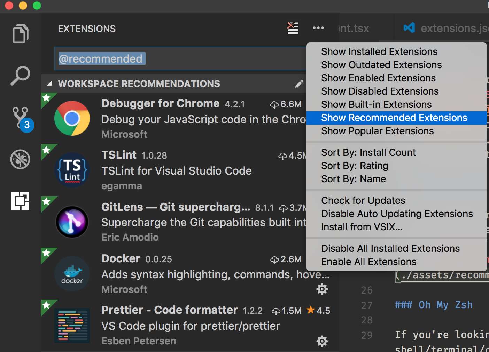
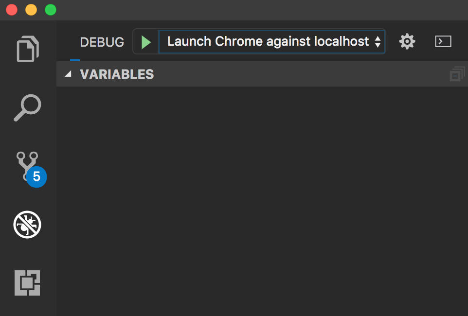

# Getting Started With Chell-Viz Development

<!-- TOC -->autoauto- [Getting Started With Chell-Viz Development](#getting-started-with-chell-viz-development)auto  - [Testing Dependencies](#testing-dependencies)auto  - [Developer Tools](#developer-tools)auto    - [VS Code](#vs-code)auto      - [Extensions](#extensions)auto      - [Debugging](#debugging)auto      - [Formatting](#formatting)auto    - [iTerm2](#iterm2)auto    - [Oh My Zsh](#oh-my-zsh)auto    - [Ack](#ack)auto  - [Project Structure](#project-structure)auto    - [Frontend Stack](#frontend-stack)auto    - [Build System](#build-system)auto    - [The DevServer](#the-devserver)auto    - [Being The CI/CD You Want To See In The World](#being-the-cicd-you-want-to-see-in-the-world)auto      - [Pre-commit](#pre-commit)auto      - [Circle CI](#circle-ci)autoauto<!-- /TOC -->

In order to build and run the chell-viz repo, all you will need to manually download is a package manager - This project is using [yarn](https://yarnpkg.com/), but `npm` _should_ _mostly_ suffice.

Once that is installed, open a shell/terminal/command-line to the repo and install all the dependencies with the following command:

```sh
yarn
```

This will create and populate a `node_modules` folder containing all of our external npm dependencies. [Please refrain from peeking inside](https://medium.com/@jdan/i-peeked-into-my-node-modules-directory-and-you-wont-believe-what-happened-next-b89f63d21558).

## Testing Dependencies

If you wish to locally run the unit tests, a few extra tools might need to be downloaded depending on your setup. This is because we mock the browser canvas (using [node-canvas](https://github.com/Automattic/node-canvas) which, in turn, requires various libraries.

If you are using Mac, I recommend using [Homebrew](https://brew.sh/) for package management and running `brew install pkg-config cairo pango libpng jpeg giflib librsvg`.

## Developer Tools

This section is to briefly go over some tools to hopefully make your development experience as cozy as possible, but should not in any way be required to run chell visualizations.

### VS Code

Quick detour for tools! It is highly recommended to use [Visual Studio Code](https://code.visualstudio.com/) as your IDE for this project, to take advantage of quite a few developer perks. Simply open the chell-viz folder in VSCode to get started!

#### Extensions

First things first, assuming you're a ~fresh convert~ new user, open the extensions panel with `⇧⌘X`. Select `Show Recommended Extensions` like so:



This will populate a list of about 20 various extensions recommended by the Chell team.

Some of them aren't really specific to this project, like the IDE themes, while some _do_ have settings set up in the `.vscode` directory. Two such extensions are the Code Spell Checker and Debugger for Chrome.

Speaking of...

#### Debugging

Let's now open the debug panel in VSCode, either by clicking the icon or with the keyboard command `⇧⌘D`. There should be a single option selected, `Launch Chrome against localhost`:



This will start a webpack-dev-server, and open chrome to `http://localhost:8080"`. Further, you can freely use all the normal debug tools like breakpoints. All from the IDE!

#### Formatting

The `formatOnSave` setting is enabled in this workspace, which if you installed the recommended `Prettier Code Formatter` extension, will automatically use the repo's `.prettierrc` file to format code for you in-editor!

### iTerm2

If you're looking to step your shell/terminal/command-line game up, might I recommend [iTerm2](https://www.iterm2.com/)?

### Oh My Zsh

If you're still looking to step your shell/terminal/command-line game up, might I also recommend [Oh My Zsh](https://github.com/robbyrussell/oh-my-zsh)?

### Ack

I like using [https://beyondgrep.com/](ack) in place of grep. That's about it.

## Project Structure

### Frontend Stack

We are using [TypeScript](https://www.typescriptlang.org/) and [React](https://reactjs.org/) to build the interface for our visualizations that will be consumed by other developers. Digging deeper, we are wrapping libraries such as [ThreeJS](https://threejs.org/) and [D3](https://d3js.org/).

TypeScript lets us have our cake and eat it too with regards to static and dynamic typing, allowing explicit contracts to be enforced at compile time when it comes to parameter types and the like. Also, it just feels _magical_.

### Build System

We are using [Webpack](webpack.js.org) to bundle our code, assets, etc. We currently support two build modes, development and production. By default, development is used and production must be explicitly specified. For example:

```sh
# Webpack uses 'development' configuration.
yarn start
yarn build

# Webpack uses 'production' configuration.
yarn start:prod
yarn build:prod
```

You can find environment-specific webpack config files inside the `configs` directory, as well as `webpack.chell-common.ts` in the project root for the base config.

Right now the differences are minimal, however the framework is now in place to (more easily) allow finer-grained configuration.

### The DevServer

For development on frontend components, you are easily able to spin up a [Webpack DevServer](https://webpack.js.org/configuration/dev-server/) to rapidly make code changes. In addition, if you really want to move fast, try out [Hot Module Replacement](https://webpack.js.org/concepts/hot-module-replacement/) mode!

```sh
yarn start
yarn start:hot
```

### Being The CI/CD You Want To See In The World

Currently we have 2 stages of checks for code when you are ready to submit a PR. As the project grows, we will likely shuffle around what get executed locally vs remotely so as to balance rapid iterative development and catching hiccups sooner rather than later.

#### Pre-commit

The following will run when a commit is made:

- [Linting](https://palantir.github.io/tslint/) and [formatting](https://prettier.io/) on _staged_ files.
- [Documentation](http://typedoc.org/) generation.
- Unit testing via Jest's [--onlyChanged](https://facebook.github.io/jest/docs/en/cli.html#onlychanged) flag.

When formatting and adding documentation the resulting file changes will automagically be appended to your commit, requiring _no extra work on your part_!

#### Circle CI

Our [Circle CI Server](circleci.com/gh/cBioCenter/chell-viz) will run on a PR made against master. It will checkout, build, lint and test the code on a fresh machine. The test results and coverage report are also saved as artifacts for each job.
