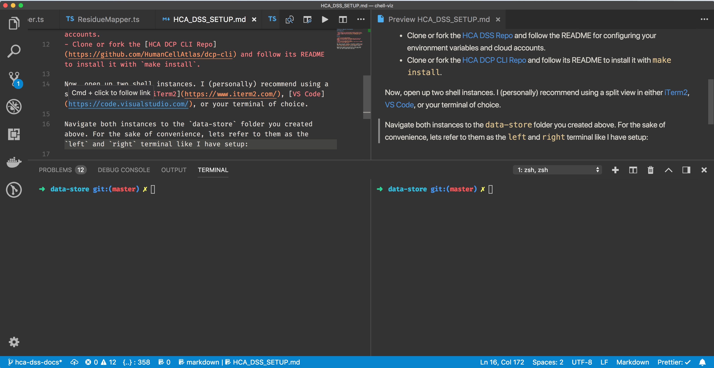

# Setting up a Human Cell Atlas Data-Store

<!-- TOC -->

- [Setting up a Human Cell Atlas Data-Store](#setting-up-a-human-cell-atlas-data-store)
  - [Setup](#setup)
    - [Pre-Requisites](#pre-requisites)
    - [Environment](#environment)
  - [Running the Data-Store](#running-the-data-store)
  - [Using Sample Data](#using-sample-data)
  - [Example environment.local File](#example-environmentlocal-file)

<!-- /TOC -->

## Setup

### Pre-Requisites

- Ensure python 3.6 is installed and the default python version.
- Create a [Amazon Web Services](https://aws.amazon.com/) account.
- Create a [Google Cloud Platform](https://cloud.google.com/) account.
- Clone or fork the [HCA DSS Repo](https://github.com/HumanCellAtlas/data-store) and follow the README for configuring your environment variables and cloud accounts.
- Clone or fork the [HCA DCP CLI Repo](https://github.com/HumanCellAtlas/dcp-cli) and follow its README to install it with `make install`. **Be sure to set the scheme to `http` per [this section of the README](https://github.com/HumanCellAtlas/dcp-cli#development)**

### Environment

Now, open up two shell instances. I (personally) recommend using a split view in either [iTerm2](https://www.iterm2.com/), [VS Code](https://code.visualstudio.com/), or your terminal of choice.

Navigate both instances to the `data-store` folder you created above. For the sake of convenience, lets refer to them as the `left` and `right` terminal like I have setup:



## Running the Data-Store

On the left, let's run the data-store. If you have not already done so, be sure to set the environment variables per the README for the data-store. See [Example environment.local File](#example-environmentlocal-file) for what I personally used, be sure to modify it accordingly based on your bucket names!

```sh
source environment.local ; ./dss-api
```

If successful, the message `Serving on :5000` will display. You can go to `http://localhost:5000/` to view the API docs for the server!

## Using Sample Data

On the right, let's upload some example data! **Be sure to provide your own bucket name**, I'll be using the values I personally setup for demonstration.

```sh
hca dss upload --replica aws --src-dir data-bundle-examples/smartseq2/paired_ends --staging-bucket chell-data-store-checkout
```

On the left you should see activity confirming data was uploaded! You can then use the returned UUID information to perform further GET requests.

## Example environment.local File

```sh
# HCA DSS environment variables: local configuration file

# Copy this file to environment.local then set your site-specific or deploy-specific environment variable values there.
# These settings override the values in the "environment" file in this directory.
# This file is sourced when you run "source environment".

# Resolve the location of this file and set DSS_HOME to the root
SOURCE="${BASH_SOURCE[0]}"
while [ -h "$SOURCE" ] ; do SOURCE="$(readlink "$SOURCE")"; done
export DSS_HOME="$(cd -P "$(dirname "$SOURCE")" && pwd)"

set -a
# Environment variable assignments (var=value) in "set -a" mode are
# automatically exported.
DSS_SUBSCRIPTION_AUTHORIZED_DOMAINS_ARRAY=(
    gmail.com
    chanzuckerberg.com
    ucsc.edu
    broadinstitute.org
    ebi.ac.uk
    {human-cell-atlas-travis-test,broad-dsde-mint-{dev,test,staging}}.iam.gserviceaccount.com
)
DSS_SUBSCRIPTION_AUTHORIZED_DOMAINS=${DSS_SUBSCRIPTION_AUTHORIZED_DOMAINS_ARRAY[*]}
DSS_SUBSCRIPTION_AUTHORIZED_DOMAINS_TEST="human-cell-atlas-travis-test.iam.gserviceaccount.com"
ADMIN_USER_EMAILS=""
DSS_SECRETS_STORE="dcp/dss"
DSS_DEPLOYMENT_STAGE=dev
API_DOMAIN_NAME=localhost:5000
AWS_DEFAULT_REGION=us-east-1
DSS_S3_BUCKET=chell-data-store-dev
DSS_S3_CHECKOUT_BUCKET=chell-data-store-checkout
DSS_S3_CHECKOUT_BUCKET_TEST=chell-data-store-checkout-test
DSS_S3_BUCKET_TEST=chell-data-store-test
DSS_S3_BUCKET_TEST_FIXTURES=chell-data-store-test-fixture
SWAGGER_URL=http://${API_DOMAIN_NAME}/v1/swagger.json
GCP_DEFAULT_REGION=us-east4
DSS_GS_BUCKET=chell-data-store-dev
DSS_GS_BUCKET_TEST=chell-hca-data-store-test
DSS_GS_BUCKET_TEST_FIXTURES=chell-hca-data-store-test-fixture
DSS_GS_CHECKOUT_BUCKET=chell-hca-data-store-checkout
DSS_GS_CHECKOUT_BUCKET_TEST=chell-hca-data-store-checkout-test
GOOGLE_APPLICATION_CREDENTIALS_SECRETS_NAME="gcp-credentials.json"
GOOGLE_APPLICATION_SECRETS_SECRETS_NAME="application_secrets.json"
set +a
```
